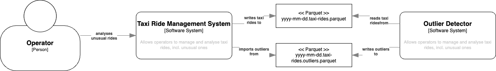
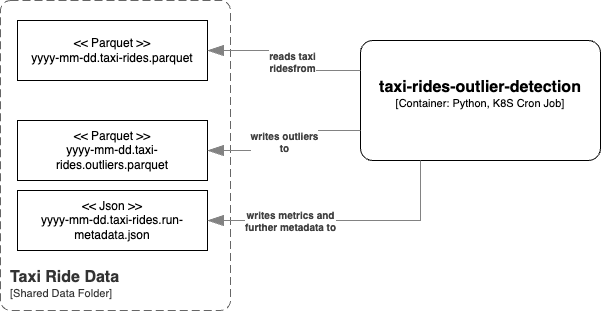
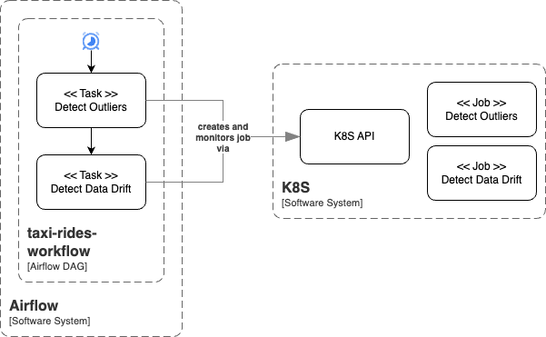

# AIS DEV2IL - MLOps - Taxi Ride Outlier Detection

This is an example project used in the exercise course of the DEV2IL lecture. 
It implements the batch prediction high level ML system design and uses the *Train-Run* training system option.

## Business Problem

You work for a taxi ride company. They want to start making rides more consistent by understanding longer journeys in order to improve customer experience and thus increase customer retention. 

### User Story: Detect unusual taxi rides

As a member of the operations team of the taxi ride company, I want to see which taxi rides were unusual compared to the all taxi rides of the same day.

Acceptance Criteria
- The list of unusual taxi rides for a day is available on the next day in the morning

## High Level System Architecture

After some discussions with the developers of the taxi ride management software system, you agree on the following system integration architecture: 
- A file containing information on all taxi rides is put to a shared location at latest at 02:00 AM on the next day
- Unusual rides are written to a shared location at latest at 06:00 AM on the next day

You additionally agree on the following interface
- Data is exchanged in [Apache Parquet](https://parquet.apache.org/) format
- Input files follow the pattern `yyyy-mm-dd.taxi-rides.parquet`
- Output files follow the pattern `yyyy-mm-dd.taxi-rides.outliers.parquet`

Input file structure
| Column Name              | Description                  |
|--------------------------|-----------------------------|
| `tpep_pickup_datetime`   | Pickup time in UTC          |
| `tpep_dropoff_datetime`  | Dropoff time in UTC         |
| `trip_distance`          | Ride distance in miles      |

Output file structure
| Column Name | Description |
|-------------|-------------|
| `ride_id`   | The row index within the input file |
| `ride_dist` | The distance of the ride in miles   |
| `ride_time` | The time of the ride in seconds     |



## Outlier Detector Architecture



## Setup

```
# Create and activate a virtual environment
python -m venv .venv
source .venv/bin/activate

# Install runtime requirements and add project in edit mode
pip install -e .
# Install development and test requirements
pip install .[dev]
pip install .[test]
```

## Notebook environment

Run `jupyter notebook` to work with the notebooks without IDE.

When using an IDE, make sure that the IDE is configured to use the project's virtual environment and that that the notebook working directory is the directory where the notebook files is located.

## Testing 

Run `pytest`.
In order to see logging and stdout outputs, use `pytest -s --log-cli-level=DEBUG`.

## Running the outlier detector on your developer machine

Run `detect-taxi-ride-outliers`. 

Example data can be found in the [work](./work) folder. Run `detect-taxi-ride-outliers ./work 2025-01-15` to detect outliers for example data.

## Working with Docker on your developer machine

To build the `taxi-rides-outlier-detection` image, run `sh build-image.sh`. 

To find outliers from a file on your local file system run `sh run-container.sh`. Run `sh run-container.sh ./work 2025-01-15` to detect outliers for example data.

## Working With the GitHub Packages Container Registry

### Using the Terminal 

In order to authenticate, you need to create a personal access token and authenticate. Follow the steps as outlined here: https://docs.github.com/en/packages/working-with-a-github-packages-registry/working-with-the-container-registry#authenticating-with-a-personal-access-token-classic

To build the `taxi-rides-outlier-detection` image, run `sh build-image-github.sh`. 

To find outliers from a file on your local file system run `sh run-container-gitlab.sh`. Run `sh run-container-gitlab.sh peterrietzler 1.0.1 ./work 2025-01-15` to detect outliers for example data.


### Using GitHub Actions

See https://docs.github.com/en/actions/use-cases-and-examples/publishing-packages/publishing-docker-images#publishing-images-to-github-packages

In order to allow your workflow to publish docker images, you need to connect the repository with the package. Make sure that you have created the package using the terminal, then 
1. Open your profile: In the top right corner of GitHub, click your profile photo, then click Your profile.
1. Open the *Packages* tab
1. Select the `taxi-rides-outlier-detection` package
1. Open *Package settings*
1. Add your repository and select the *Write* role for it


## Running the Kubernetes Cron Job

1. Deploy the cron job by running `kubectl apply -f deploy/k8s/taxi-rides-outlier-detection-cronjob.yaml`

Further useful commands
- List cron jobs: `kubectl get cronjobs`
- List cron jobs: `kubectl get jobs`
- List pods: `kubectl get pods`
- Follow logs of a pod: `kubectl logs -f POD_NAME`
- Get more information for a pod (e.g. for problem analysis): `kubectl describe pod POD_NAME`
- Delete a pod: `kubectl delete pod POD_NAME`
- Delete a job or cron job: `kubectl delete -f deploy/k8s/local/taxi-rides-outlier-detection-cronjob.yaml`

## Running Input Data Drift Detection

Run `detect-input-data-drift`. The command works similar to 
`detect-taxi-ride-outliers`. Also all K8S options are available similarly.

## Record Monitoring Snapshots using Evidently

Get more information at https://github.com/evidentlyai/evidently
and https://docs.evidentlyai.com/docs/platform/monitoring_overview

1. Run `evidently ui` in the root project folder to start the user interface
1. Run `detect-input-data-drift` using the `--evidently-project-id` option to record snapshots

## Orchestrate Taxi Ride Outlier Detection via Airflow



1. `kubectl apply -f deploy/airflow`
1. Get the `admin` password via `kubectl logs -f airflow`
1. `kubectl port-forward service/airflow-service 8080:8080`
1. Login at http://localhost:8080 (`admin` / password as obtained from the logs)